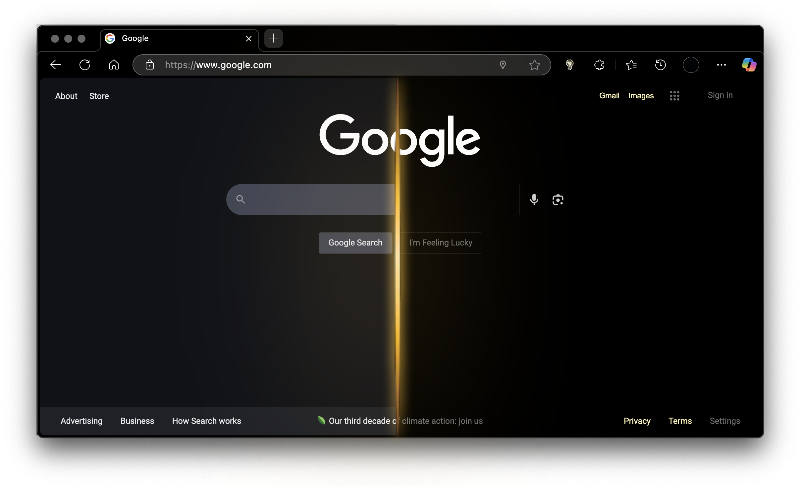
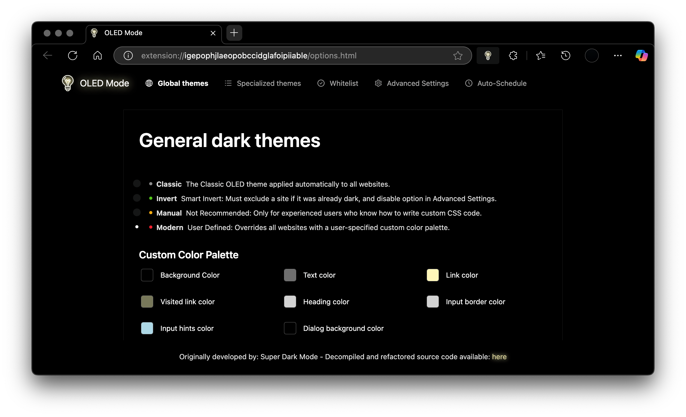

# Chrome OLED Mode Extension
**Chrome OLED Mode adds a pitch black theme to websites, making them high contrast and easy to read at night.*

DISCLAIMER: This is a resurrection of the Super Dark Mode 6.1.2 .crx obtained August 2024(now got taken down from the Chrome Web Store for purported ad injection reasons after it it's developer got compromised in December 2024: https://gitlab-com.gitlab.io/gl-security/security-tech-notes/threat-intelligence-tech-notes/malicious-browser-extensions-feb-2025/) All references to the original developer's domain has been removed from the code and no traces of the malicious code patterns described in the article exist. There should be no possibility of the extension making any external network calls.

 In my opinion, this works a lot better than the popular extension 'Dark Reader'. The extension will be actively maintained, cleaned up, documented, and stylesheet corrections made to popular sites when they break. Stay tuned for updates!

# Implementation Details
This extension is a static browser-side script which leverages React's dynamic rendering and live component updating mechanisms. At runtime, it waits for the DOM to finish loading, then injects content into a dedicated element (#__oled). Using ReactDOM.createRoot, it mounts a themed layout component that wraps the core UI, enabling declarative reactivity and efficient DOM updates. The layout system, sourced from @plasmo-static-common/react, applies a custom stylesheet. Parcel handles bundling and dependency resolution using a simulated require system embedded in the file which mimics module caching and isolation in a browser-compatible way. Features high precision and low overhead, while maintaining compatibility with extension sandbox constraints and update mechanisms. Supports; 4 different operation modes, 40 specialized site-specific themes, whitelist management, and automatic scheduling.

This extension is a static client-side script built with React. It waits for the page to load, then mounts a themed UI using ReactDOM.createRoot inside a designated element. Styles and layout come from Plasmo's React system. Why am I seeing obfuscated variables? Parts of the code are minified because it's decompiled from the prod build distributed to mass audiences via the Chrome Web Store-an effort will be made by me to rewrite the UI without these bits at a later time. Parcel handles the bundling, with module caching for performance. It supports 4 modes, 40 site-specific themes, a whitelist, and auto-scheduling all while staying within Chrome extension sandbox rules.

[Download Latest Release](https://github.com/FreelanceProgrammingServices/Chrome-OLED-Mode/releases/latest)

## Installation

1. Download the latest `Chrome-OLED-Mode.crx` from the [releases page](https://github.com/yourusername/Chrome-OLED-Mode/releases/latest) 
2. Go to chrome://extensions and enable Developer mode 
3. Load Unpacked and select folder containing extracted files

## Support
Tested on:
 Google Chrome Version 135.0.3179.85

## License

This project is released under Public Domain.

---

